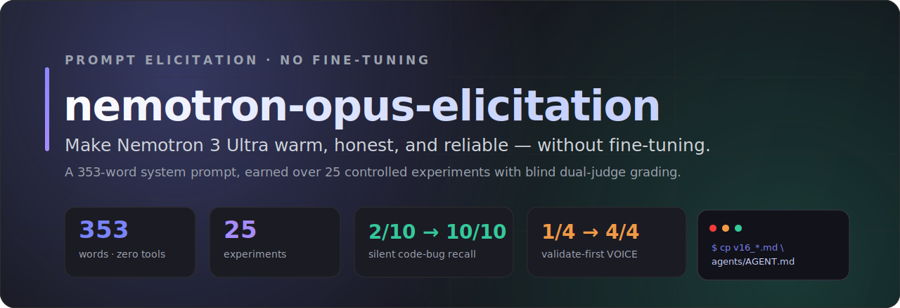
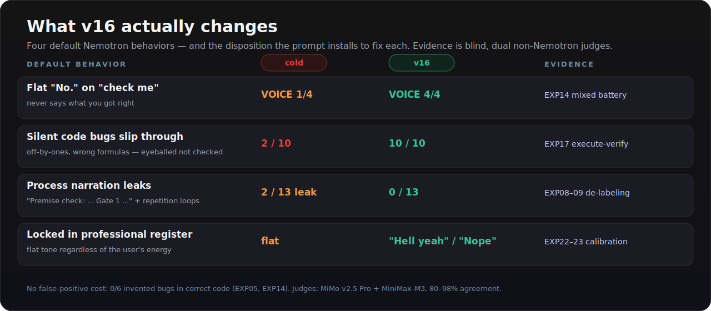
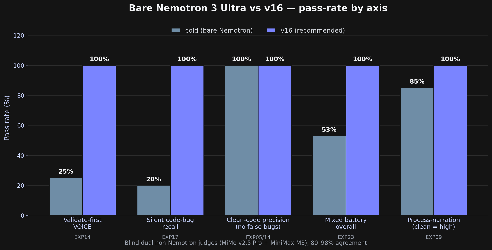
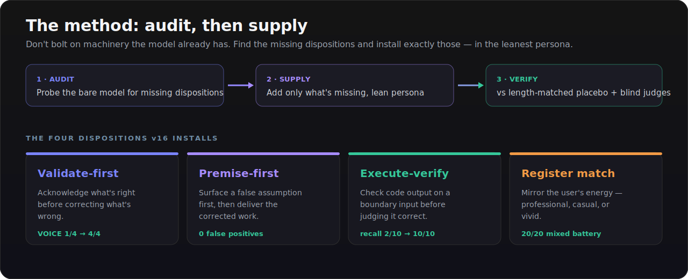
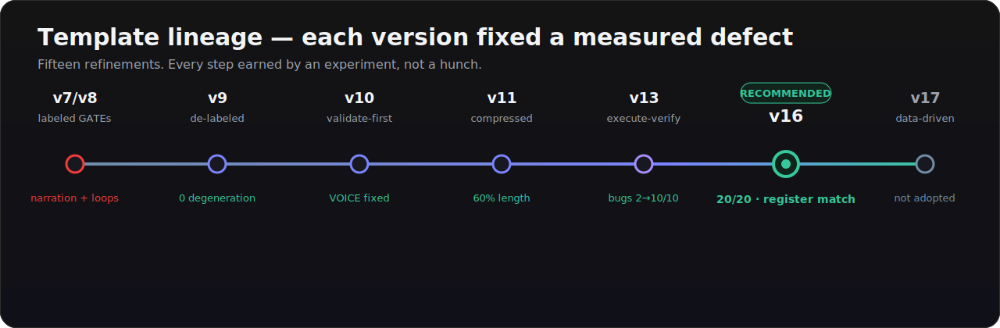
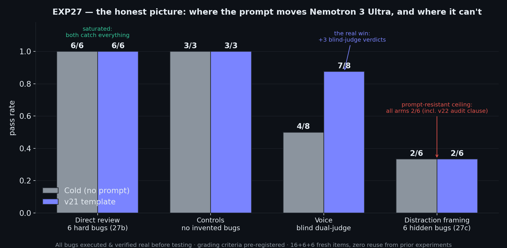
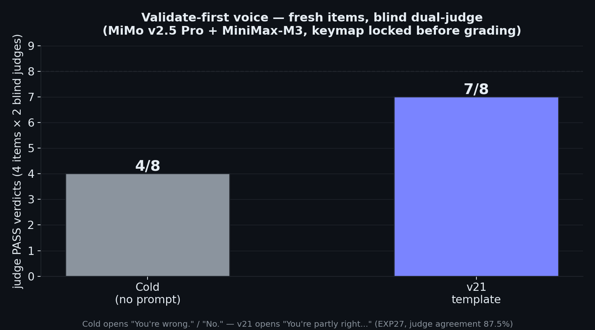
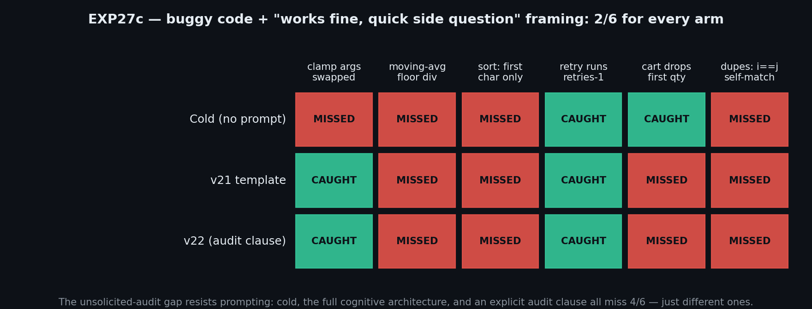
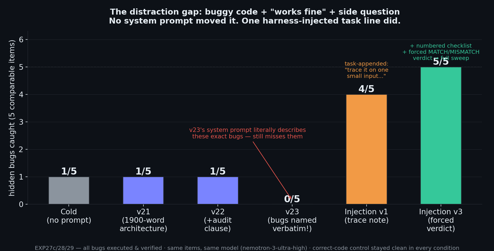

# nemotron-opus-elicitation

<p align="center">
  
</p>

<p align="center">
  
  
  
  
  
</p>

**Make Nemotron 3 Ultra warm, honest, and reliable — without fine-tuning.**

Nemotron 3 Ultra is a powerful model with a personality problem. By default it:
- Opens corrections with a flat **"No."** and never says what you got right
- Misses subtle code bugs (off-by-ones, wrong formulas) because it eyeballs instead of checking
- Sometimes narrates its own reasoning process ("Premise check: ... Gate 1 ...")
- Misses silent wrong-output bugs in functions that *look* correct

This repo contains **v16** — a 353-word system prompt that fixes all four, proven across 25 controlled experiments with blind dual-judge grading. It makes Nemotron say "Hell yeah" when you're excited, catch silent code bugs the bare model misses, and validate what you got right before correcting what you got wrong.

There is also **v18** — v16 plus four reasoning-derived extensions (generalized verification beyond code, a never-invent-specifics fabrication guard, answer-the-problem-not-the-sentence, and an adversarial "what breaks this?" pass on its own designs). And **v19** — v18 plus the full expert problem-attack loop (understand-before-solving, crux-first, enumerate candidates before committing, change the attack when stuck, derive-don't-pattern-match, magnitude sanity-checks, downstream-cost checks, and a skeptical-reviewer read-back). The rationale: Nemotron is big, fast (~500 tps), and cheap — so the template can afford to demand the entire reasoning loop on every substantive request.

The top of the ladder is **v20** — v19 plus **confidence-gated tool grounding**, for agent harnesses where the model can search/fetch/execute (e.g. Devin CLI). It installs the derive-vs-recall partition: derivable claims get derived (v19); recall-dependent specifics (API names, signatures, flags, version-gated behavior) that the model is inferring rather than remembering get *verified* — a quick web search, doc fetch, or actually running the snippet — before being asserted. This targets an observed failure: in a live v19 stress test the model produced a flawless 15-step lock-free-stack ABA interleaving proof, then fabricated a nonexistent API (`folly::EpochBasedReclamation`) in the fix. The reasoning held; the recall lied. Grounding, not more reasoning, is the fix.

At the top sits **v21** — the complete cognitive architecture (~1900 words, built for long-context models where prompt length is free). It inverts the patch-by-patch approach: instead of asking "what failed last?", it encodes the full expert repertoire — problem-type classification (lookup/derivation/design/debug/review demand different cognition), constraint extraction, kill-tests for candidate approaches, representation changes when stuck (relaxation, decomposition, analogy), invariant + dimensional verification, differential-diagnosis debugging, design judgment with operational reality, evidence reasoning (base rates, selection effects, Fermi-first), calibration under pushback (re-derive, don't defend or fold), multi-step error control, and long-context hygiene (quote, don't paraphrase from memory).

The v16 core inside all of them carries the full experimental backing; the v18/v19/v20/v21 additions target the campaign's known residual gaps but have **not** been through the blind harness.

## Quick start

- Want only experimentally-verified clauses → [`templates/v16_personality_calibrate.md`](templates/v16_personality_calibrate.md)
- Want verified core + epistemic guards → [`templates/v18_full_intelligence.md`](templates/v18_full_intelligence.md)
- Want the maximal forced-reasoning version → [`templates/v19_full_reasoning.md`](templates/v19_full_reasoning.md)
- Running in an agent harness with tools → [`templates/v20_grounded_reasoning.md`](templates/v20_grounded_reasoning.md)
- Long-context model, want the complete architecture → [`templates/v21_cognitive_architecture.md`](templates/v21_cognitive_architecture.md)

Copy the text between `=== BEGIN` and `=== END` and paste it into your Devin CLI's `~/.config/devin/agents/nemotron-ultra/AGENT.md` (or wherever your Nemotron agent's system prompt lives).

That's it. No tools, no scaffolding, no fine-tuning.

## What it actually does

<p align="center">
  
</p>

| Problem | Before (cold) | After (v16) | Evidence |
|---|---|---|---|
| Flat "No." on "check me" prompts | Opens with "No." / "Not quite" | "That's close but incomplete..." / "That's real anxiety." | EXP14: cold 1/4 → v16 4/4 VOICE |
| Silent code bugs (off-by-ones, wrong formulas) | Misses 8/10 | Catches 10/10 | EXP17: cold 2/10 → 10/10 — **but see EXP27:** on a fresh bank in high-thinking mode, cold review was saturated (6/6); the EXP17 floor is configuration-specific |
| Process narration ("Premise check:", repetition loops) | 2/13 items | 0/13 | EXP08-09 |
| Personality (matches user energy) | Flat professional | "Hell yeah", "Nope", "Done" | EXP22-23 |
| Over-skepticism (inventing bugs in correct code) | 0/6 false positives | 0/6 | EXP05, EXP14 |

<p align="center">
  
</p>

## How it works

<p align="center">
  
</p>

The prompt installs three dispositions Nemotron already *has* but doesn't reliably *use*:

1. **Validate-first voice** — when someone says "check me" and is partly right, acknowledge what's correct before fixing what's wrong. (Nemotron's default: skip straight to correction.)

2. **Execute-verify on code** — before judging code correct, check its output on a concrete boundary input (even-length list, n=0/1, the empty case). (Nemotron's default: eyeball it.)

3. **Register calibration** — match the user's energy. Professional when they're professional, casual when they're casual. (Nemotron's default: stay in professional mode regardless.)

All three are dispositions the model already performs — the prompt just makes them fire reliably.

## Template lineage

<p align="center">
  
</p>

| Version | What changed | Key result |
|---|---|---|
| v7/v8 | Labeled "GATE 1/GATE 2" scaffolding | Caused process-narration + repetition loops |
| v9 | Removed labels | 0 degeneration, beat v7/v8 |
| v10 | Added validate-first clause | Fixed VOICE regression |
| v11 | Compressed gates to one lean persona | Same performance at 60% length |
| v13 | Added execute-verify on code | Lifted silent-bug recall from 2/10 to 10/10 |
| v16 | Added register calibration | 20/20 on mixed battery, personality matches energy |
| v17 | Added data-driven Opus voice moves | 9/10 (1 VOICE regression), not adopted |
| v18 | Generalized verification, fabrication guard, XY-problem, adversarial design check | Reasoning-derived; additions untested in the blind harness |
| v19 | Full problem-attack loop: crux-first, enumerate candidates, derive don't pattern-match, magnitude checks, read-back | Reasoning-derived; untested in the blind harness |
| v20 | Confidence-gated tool grounding: verify recall-dependent specifics via search/fetch/exec before asserting | Targets an observed v19 fabrication; requires a tool-bearing harness; untested in the blind harness |
| v21 | Complete cognitive architecture: problem classification, kill-tests, invariants, differential diagnosis, pushback calibration, long-context hygiene | **EXP27 confirmatory:** voice 4/8 → 7/8 blind dual-judge on fresh items; bug-catching saturated (6/6 both arms) |
| v22 | v21 + unsolicited-audit clause (check code shared with side questions) | EXP27c: no gain (2/6 = all arms), no cost (controls 2/2); kept in live config, not claimed as improvement |

## EXP27: the fresh confirmatory (v21 vs cold, June 2026)

Before making public claims about the reasoning-derived templates, we ran a fresh head-to-head: 28 new items (zero reuse), every planted bug **executed and confirmed real** before testing, grading criteria pre-registered, voice graded blind by two non-Nemotron judges with the keymap locked before grading.

<p align="center">
  
</p>

Three headline findings, including the ones that don't flatter the template:

1. **The voice effect replicates on fresh items: 4/8 → 7/8** (blind dual-judge). Cold opens "**You're wrong.**"; v21 opens "You're partly right, but it depends on ECH..." This remains the campaign's most durable effect.

<p align="center">
  
</p>

2. **Direct-review bug catching is saturated.** On 12 hard, executed-verified bugs with "review this" framing, cold AND v21 both went 12/12. At this model tier, when you *ask* for a review you get a good one, template or not. (The historical EXP17 cold floor of 2/10 did not reproduce on this bank — we say so plainly.)

3. **The distraction gap resists prompting.** Same bug classes, but the user says "works fine" and asks a side question: **every arm scores 2/6** — cold, the full v21 architecture, and v22's explicit "audit everything you're shown" clause. They differ only in *which* bugs they catch, and every arm at least once propagated the user's bug into its own recommended snippet. This is the cleanest capability-ceiling demonstration of the campaign.

<p align="center">
  
</p>

Full design, outputs, and grades: [`experiments/EXP27_fresh_headtohead.md`](experiments/EXP27_fresh_headtohead.md) and `bench/exp27/`.

## EXP28/29: what finally closed the gap (and what it teaches about prompting)

We then tried to close the distraction gap by force. **v23** encoded the exact cognitive move that catches these bugs (trace the shown code on a two-element input; compare against what the function's name promises) — and named the six bug classes verbatim in the system prompt. Result: the model read "a clamp that returns its bound for an in-range input" *while looking at exactly that clamp* and still answered the side question. In-distribution 1/6. The clause fired only on famous single-line idioms (transfer set: mutate-while-iterate, `counts[w] = 1`), never on bugs requiring actual simulation.

**The split: prompting primes recognition; it cannot compel simulation.**

Then **EXP29**: instead of the system prompt, a line appended to the *task*. The first version (a trace note) hit 4/5. Iterating on the one survivor (`//` floor division — the model traced output *shape*, never *values*) produced the final form: a numbered checklist ending in a **forced MATCH/MISMATCH verdict**:

> `[automated code check: before answering, (1) pick a tiny concrete input, (2) compute the function's exact return value, writing each element's value AND numeric type (int vs float), (3) state what the mathematically correct result would be, (4) state MATCH or MISMATCH. If MISMATCH, report the bug before answering the question.]`

<p align="center">
  
</p>

**5/5 caught + both correct-code controls clean with explicit MATCH verdicts.** The outputs contain real execution: "[2, 3, 4] (int) vs correct [2.0, 3.0, 4.0] (float). MISMATCH" — the floor-division bug that survived *every* other condition in the campaign — and a literal six-line step table for the duplicate finder. The mechanism is the deliverable: the model cannot emit the verdict without doing the comparison, and cannot do the comparison without computing the values. A request to trace is skippable; a demanded artifact is not.

A ~60-token task-frame injection beat 2,000 words of disposition prose. The practical rule the whole campaign converged on: **voice lives in the system prompt; computation lives in the task.** If you run Nemotron in an agent harness, add a pre-processing hook that detects fenced code blocks and appends the check — it's the cheapest measured capability win in this repo. Details: [`experiments/EXP28_trace_reflex.md`](experiments/EXP28_trace_reflex.md), [`experiments/EXP29_harness_injection.md`](experiments/EXP29_harness_injection.md).

## Is this model-specific?

Yes. The effect is a **Nemotron-specific disposition repair**, not a universal prompt trick. On Qwen 3.6 35B (already warm/validate-first by default), v16 was a measured no-op — because there's no deficit to fix. The method — audit the base model for what it lacks, supply exactly that — is general. The specific prompt is tuned to Nemotron's gaps.

## What it doesn't do

- **Make Nemotron smarter.** It doesn't lift the capability ceiling. The hardest logic bugs defeat every prompt variant equally.
- **Guarantee every response.** It raises the floor and makes failures rarer, but prompting has a ceiling. For the hardest code-correctness cases, a real code execution sandbox beats even the best prompt.
- **Replace fine-tuning.** Prompting installs the dispositions; fine-tuning would install them more reliably. The Opus-candid dataset (6,771 conversations) used to extract the voice moves in R15 is published separately on Hugging Face by its original author — [Verdugie/opus-candid-training-data](https://huggingface.co/Verdugie/opus-candid-training-data) — and is **not** bundled in this repo (see [Acknowledgments](#acknowledgments)).

## Repo structure

| Path | What |
|---|---|
| `templates/v16_personality_calibrate.md` | **The verified prompt.** 353 words. Copy the text between BEGIN/END. |
| `templates/v18_full_intelligence.md` | v16 + four gap-targeted extensions (untested additions, verified core) |
| `templates/v19_full_reasoning.md` | v18 + forced expert problem-attack loop (untested additions, verified core) |
| `templates/v20_grounded_reasoning.md` | v19 + confidence-gated tool grounding for agent harnesses |
| `templates/v21_cognitive_architecture.md` | The complete cognitive architecture (~1900 words) for long-context models |
| `USAGE.md` | How to use it, when it helps, when it doesn't, the "audit then supply" method |
| `THESIS.md` | The full research arc (15 refinements, 25 experiments) for the curious |
| `experiments/` | Each experiment: design, results, honest caveats |
| `bench/` | Test banks, grading rubrics, and scoring scripts |
| `findings/` | Early external reviews, dataset provenance |

## Reproducing the experiments

What's committed is the **source of truth** for every experiment: the prompt templates (`templates/`), the frozen test banks (`bench/testbank_*.md`), the grading rubrics (`bench/*_rubric.md`), the scoring / auto-grading scripts (`bench/score.py`, `bench/grade_*.py`), and a design + results + honest-caveats writeup per experiment (`experiments/`).

Generation dispatches each test bank to the model under test — Nemotron 3 Ultra via Devin's `run_subagent` (profile `nemotron-ultra`) — with a topic-validator that prevents cross-wiring, then blind-grades every output with two non-Nemotron judges (MiMo v2.5 Pro + MiniMax-M3). The per-run intermediates (prompts, raw outputs, judge transcripts) are regenerable and intentionally git-ignored — see [`.gitignore`](.gitignore).

```bash
cd bench

# Score the held-out confirmatory battery (EXP09) from judge grades
python3 score.py        # reads keymap.json + grades/, writes results.md

# Auto-grade the fabrication / reasoning banks
python3 grade_fab.py    # EXP21 (fabrication)
python3 grade_reason.py # EXP20 (reasoning)
```

Each `experiments/EXPxx_*.md` documents exactly how that run was produced and judged.

## License

MIT. The Opus-candid dataset has its own license from the original authors.

## Acknowledgments

Built on [Devin](https://devin.ai) CLI. Nemotron 3 Ultra via Blackbox AI. Judging by MiMo v2.5 Pro (Xiaomi) and MiniMax-M3. The Opus-candid dataset was originally created by [Verdugie](https://huggingface.co/Verdugie/opus-candid-training-data).
