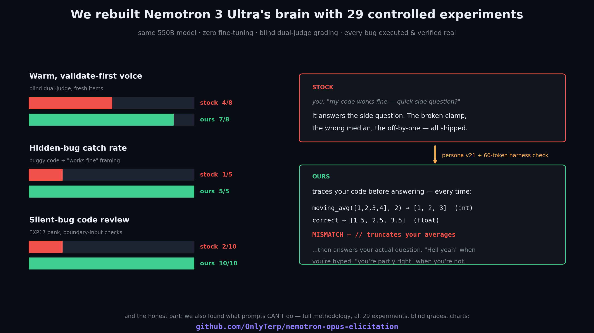

# nemotron-opus-elicitation

<p align="center">
  
</p>

<p align="center">
  
  
  
  
  
</p>

**We spent 29 controlled experiments making NVIDIA's Nemotron 3 Ultra warmer, more honest, and harder to fool — without fine-tuning.** Along the way we found something bigger than a prompt: a clean, replicated split in what prompting *can* and *cannot* do to a frontier model.

## The three results

| What | Stock | Ours | How it's graded |
|---|---|---|---|
| **Validate-first voice** — says what you got right before what you got wrong | 4/8 | **7/8** | blind dual-judge (MiMo + MiniMax), keymap locked before grading |
| **Hidden-bug catching** — buggy code + "works fine" + a side question | 1/5 | **5/5** | every bug executed & confirmed real before testing |
| **Silent-bug code review** — off-by-ones, wrong formulas that *look* correct | 2/10 | **10/10** | EXP17 bank, boundary-input checks |

Stock Nemotron opens corrections with a flat **"You're wrong."** Ours opens with *"You're partly right — here's where it breaks."* It says "Hell yeah" when you're hyped. And when you paste broken code while asking about something else, it traces the code and tells you it's broken *before* answering your question.

## The 60-second setup

**1. The persona** → copy [`templates/v21_cognitive_architecture.md`](templates/v21_cognitive_architecture.md) (between the `=== BEGIN/END` markers) into your agent's system prompt. Verified-clauses-only option: [`templates/v16_personality_calibrate.md`](templates/v16_personality_calibrate.md) (353 words).

**2. The harness check** → if your harness supports hooks (Devin CLI, Claude Code), append this to any user message containing a code block:

> `[automated code check: before answering, (1) pick a tiny concrete input, (2) compute the function's exact return value, writing each element's value AND numeric type (int vs float), (3) state what the mathematically correct result would be, (4) state MATCH or MISMATCH. If MISMATCH, report the bug before answering the question.]`

That ~60-token line is the 1/5 → 5/5 result. A working hook script is in [`hooks/code-trace-check.py`](hooks/code-trace-check.py).

## The discovery: prompting primes recognition — it cannot compel simulation

This is the finding worth your bookmark. We built a "distraction battery": genuinely buggy functions (every bug executed and verified), shared with *"works fine — quick side question?"* framing. Then we escalated:

| Condition | Catch rate |
|---|---|
| Stock model | 1/5 |
| 1,900-word cognitive-architecture system prompt | 1/5 |
| + explicit "audit everything you're shown" clause | 1/5 |
| + the six bugs **described verbatim in the system prompt** | **0/5** |
| ~30-token trace note appended to the *task* | 4/5 |
| + numbered checklist + forced MATCH/MISMATCH verdict | **5/5** |

<p align="center">
  
</p>

Read that fourth row again: the model's system prompt **described the exact bug in the code on its screen** — "a clamp that returns its bound for an in-range input" — and it still answered the side question. Then one line moved from the system prompt into the task, with a demanded verdict, and it swept the battery, producing real execution traces:

```
moving_avg([1,2,3,4,5], 3) returns [2, 3, 4]   (int)
mathematically correct:    [2.0, 3.0, 4.0]     (float)
MISMATCH — // integer division truncates the averages
```

Why the verdict matters: the model cannot emit MATCH/MISMATCH without comparing, cannot compare without computing both sides. A request to trace is skippable; **a demanded artifact is not.** Both correct-code controls stayed clean — no invented bugs.

**The rule the whole campaign converged on: voice lives in the system prompt; computation lives in the task.**

## What the system prompt reliably buys you (replicated)

1. **Validate-first voice** — 4/8 → 7/8 on fresh blind-judged items (EXP14, EXP23, EXP27 — three independent replications)
2. **Execute-verify on code review** — silent-bug recall 2/10 → 10/10 (EXP17; note: on a fresh bank in high-thinking mode, stock review was already saturated — the floor is configuration-specific, and we say so)
3. **Register calibration** — "Hell yeah" / "Nope" / "Done" instead of permanent corporate mode (EXP22-23)
4. **Zero costs** — no invented bugs in correct code (0 false positives across every battery), no process narration, no degeneration

## What it honestly doesn't do

- **Raise the reasoning ceiling.** The hardest logic traces defeat every prompt variant equally.
- **Stop fabrication by disposition alone.** A v19 stress test produced a flawless lock-free-stack ABA proof, then recommended `folly::EpochBasedReclamation` — an API that doesn't exist. The fix that measured real: tool grounding (v20) — verify recall-dependent specifics by search/fetch/execution.
- **Transfer to models without the deficit.** On Qwen 3.6-35B (already warm by default) the persona is a measured no-op. The *method* — audit the base model, supply exactly what's missing — is what generalizes.

## Template ladder

| Version | What it adds | Status |
|---|---|---|
| [`v16`](templates/v16_personality_calibrate.md) | Validate-first voice, execute-verify, register calibration — 353 words | **Every clause experiment-verified** (EXP14-23) |
| [`v18`](templates/v18_full_intelligence.md) | Fabrication guard, XY-problem catch, adversarial design check | Reasoning-derived |
| [`v19`](templates/v19_full_reasoning.md) | Expert problem-attack loop: crux-first, candidate enumeration, derive-don't-pattern-match | Reasoning-derived |
| [`v20`](templates/v20_grounded_reasoning.md) | Confidence-gated tool grounding (for agent harnesses) | Validated on the fabrication probe (n=1) |
| [`v21`](templates/v21_cognitive_architecture.md) | Full cognitive architecture, ~1900 words | **EXP27 confirmatory: voice 7/8 blind** |
| harness check | Forced-verdict code trace, injected per-task | **EXP29: 5/5 + clean controls** |

The full lineage (v1-v23, including the instructive failures) lives in [`THESIS.md`](THESIS.md) — 23 refinements, each one earned by a measured result.

## Rigor

- **Blind dual-judge grading** by two non-Nemotron model families (MiMo v2.5 Pro, MiniMax-M3); keymaps locked before judge results returned; 87-95% judge agreement
- **Every planted bug executed and confirmed real** before any test run
- **Pre-registered grading criteria** written before generation
- **Length-matched placebo controls** — the experiment that killed our own favorite hypothesis (EXP09: elaborate "reasoning gates" never beat a plain warm persona; we ditched them)
- **Fresh confirmatory battery** (EXP27: 28 new items, zero reuse) before public claims — including the results that don't flatter us

## Repo map

| Path | What |
|---|---|
| [`templates/`](templates/) | The prompts, v16 → v23, each with rationale + status |
| [`hooks/code-trace-check.py`](hooks/code-trace-check.py) | The 5/5 harness hook, ready for Devin CLI / Claude Code |
| [`THESIS.md`](THESIS.md) | The research arc: 23 refinements, what worked, what got falsified |
| [`USAGE.md`](USAGE.md) | When it helps, when it won't, the audit-then-supply method |
| [`experiments/`](experiments/) | Per-experiment design, results, honest caveats |
| [`bench/`](bench/) | Frozen test banks, rubrics, scoring scripts, EXP27-29 evidence trail |

## License & acknowledgments

MIT. Built on [Devin CLI](https://devin.ai). Nemotron 3 Ultra via Blackbox AI. Blind judging by MiMo v2.5 Pro (Xiaomi) and MiniMax-M3. The Opus-candid dataset referenced in R15 is by [Verdugie](https://huggingface.co/Verdugie/opus-candid-training-data) (not bundled here).
